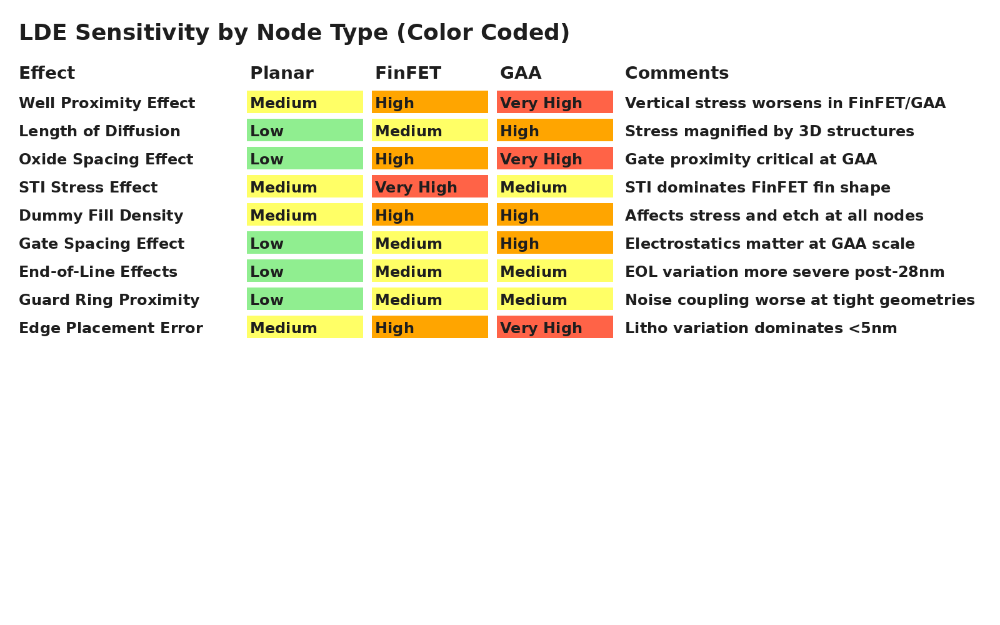

# Layout Dependent Effects (LDE)

Layout Dependent Effects (LDE) describe how the physical placement of transistors, nearby structures, and surrounding layout features affect electrical performance—especially in advanced CMOS technologies like FinFET and GAA.

LDE can degrade speed, break matching, or shift threshold voltages enough to cause design failure, particularly in analog, high-speed, or tightly matched circuits.

---

## Common LDE Mechanisms (with Description, Impact, and Mitigation)

| Effect | Description | Impact | Mitigation |
|--------|-------------|--------|------------|
| **Well Proximity Effect (WPE)** | Variation in Vt due to proximity to well edge | Shifts in threshold voltage near well edges | Avoid placing transistors near well boundaries or use dummy devices to maintain spacing |
| **Length of Diffusion (LOD)** | Device characteristics change with OD length | Alters drive strength, mobility, and mismatch behavior | Use symmetric OD lengths for matched devices; apply dummy OD |
| **Oxide Spacing Effect (OSE)** | Effective channel length variation due to nearby poly spacing | Impacts gate control, Vt, and short-channel effects | Maintain consistent poly spacing with dummy gates |
| **STI Stress Effect** | Isolation structures (shallow trench) induce mechanical stress | Changes carrier mobility, especially in PMOS | Use stress balancing with dummy poly or OD structures |
| **Dummy Fill Density** | Dummy metal/polysilicon alters stress and etch profiles | Induces device variation and leakage shifts | Follow fill symmetry rules; use fill-aware placement tools |
| **Gate Spacing Effect** | Gate-to-gate spacing alters local electric field | Degrades linearity in analog devices | Use matched spacing and avoid asymmetry in critical pairs |
| **End-of-Line (EOL) Effects** | Device edges near layout boundaries behave inconsistently | Performance shifts near chip or macro edges | Keep devices away from edge-of-block; add guard rings or edge symmetry |
| **Guard Ring Proximity** | Proximity to N-well or P+ guard rings shifts biasing | Affects leakage, noise isolation | Space rings consistently; use same surroundings for matched devices |
| **Edge Placement Error (EPE)** | Optical litho differences at edges cause shape variability | Unreliable W/L at drawn edges | Follow OPC-aware design rules; avoid minimum dimensions near edges |

---

## Why LDE Matters

- Analog and mixed-signal circuits require **tight matching**—LDE can break that
- FinFET and GAA devices are **extremely sensitive** to context
- Even small shifts in Vt, drive strength, or leakage can cascade into functional failure

---

## Layout Best Practices for LDE Mitigation

- Use **common centroid layout** for matched pairs
- Maintain **dummy symmetry** around devices (OD, poly, metal)
- Respect **minimum context windows** defined by the PDK
- Add **dummy poly or OD** to balance stress across arrays
- Avoid **well edges, STI corners, or macro boundaries** near analog IP

---

## LDE Sensitivity by Node Type

Different layout-dependent effects become more or less significant depending on the transistor architecture—Planar CMOS, FinFET, or GAA (Gate-All-Around). This table summarizes how the impact of each effect scales and why it matters at advanced nodes.

---
